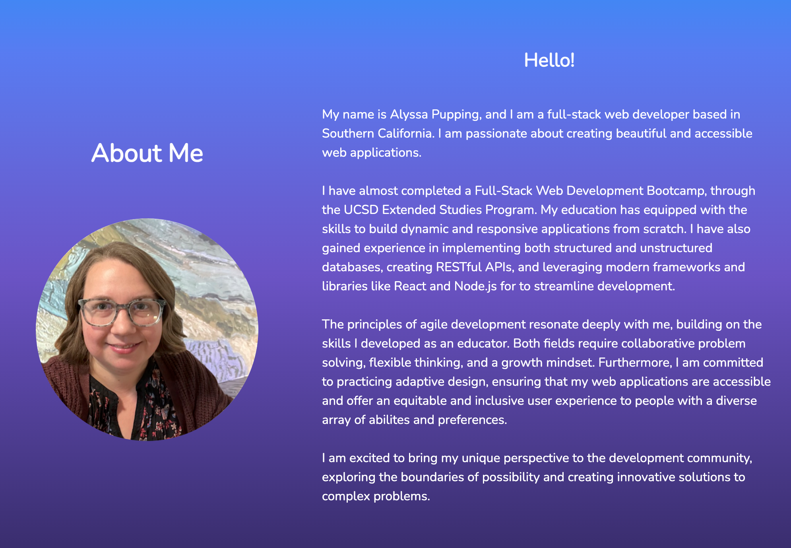
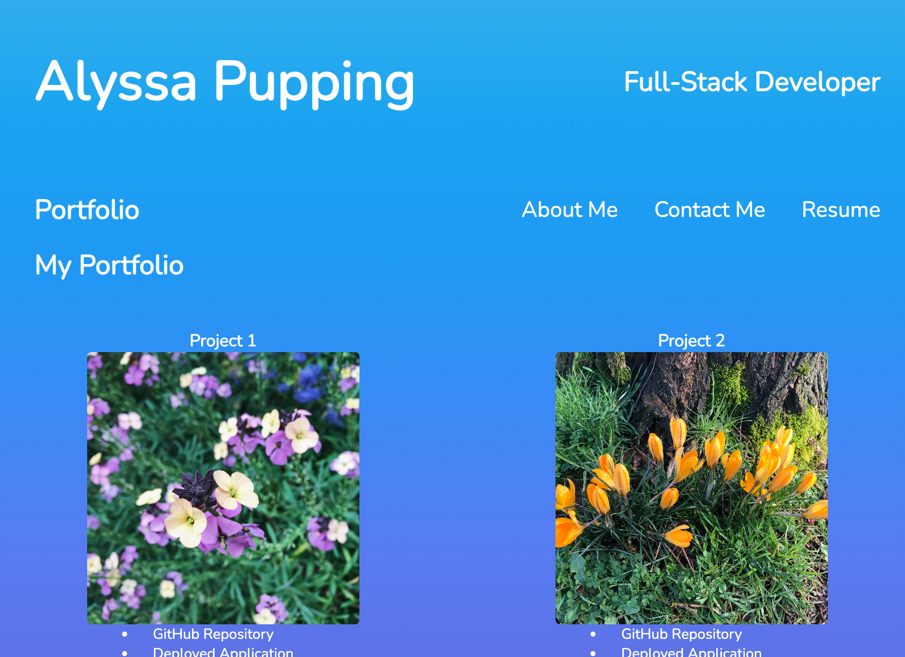
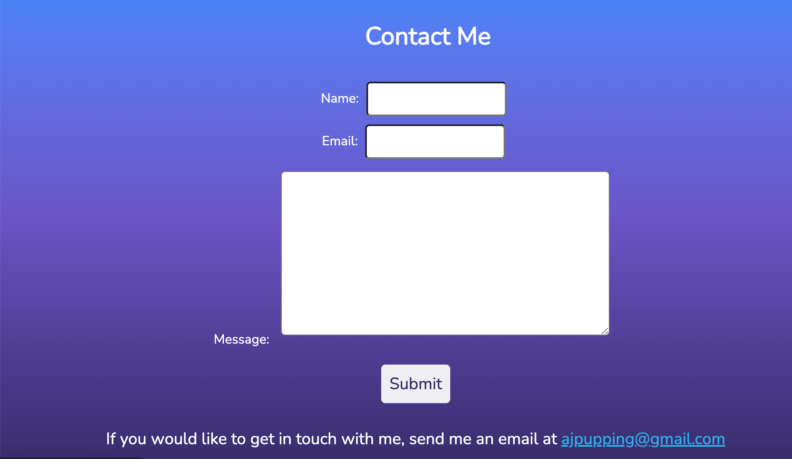

# React Portfolio

[View the deployed site](https://ajp-react-portfolio.netlify.app/)

## Description 

The purpose of this project was to design and build a personal portfolio using React and deploy it using Netlify. 

I learned how to add images so that they would be visilble when the site is deployed. I also learned how to use NavLink to highlight the active page navigation links. I used iframe to add a pdf viewer so that users could view my resume before downloading it. 

## Usage 

Clicking About Me in the navigation bar will take users the About section.

Clicking Portfolio in the navigation bar will take users to the portfolio section, featuring 6 projects.

Clicking Contact Me in the navigation bar will take users to the contact form, where they can enter their information or send an email. 

## Credits 

I used [this guide](https://ncoughlin.com/posts/react-fonts-with-fontsource/) to learn about importing different fonts. 

I used [this tutorial](https://medium.com/@leahcardoz/how-to-change-the-favicon-title-of-your-react-app-in-5-minutes-9163e023b8d2) to learn how to change the favicon. 

[This site](https://mycolor.space/gradient3?ori=to+bottom&hex=%233FAEEE&hex2=%237D62EA&hex3=%23362A69&submit=submit) helped me create a color gradient background. 

## License

This project was created for educational purposes and does not have a license. 